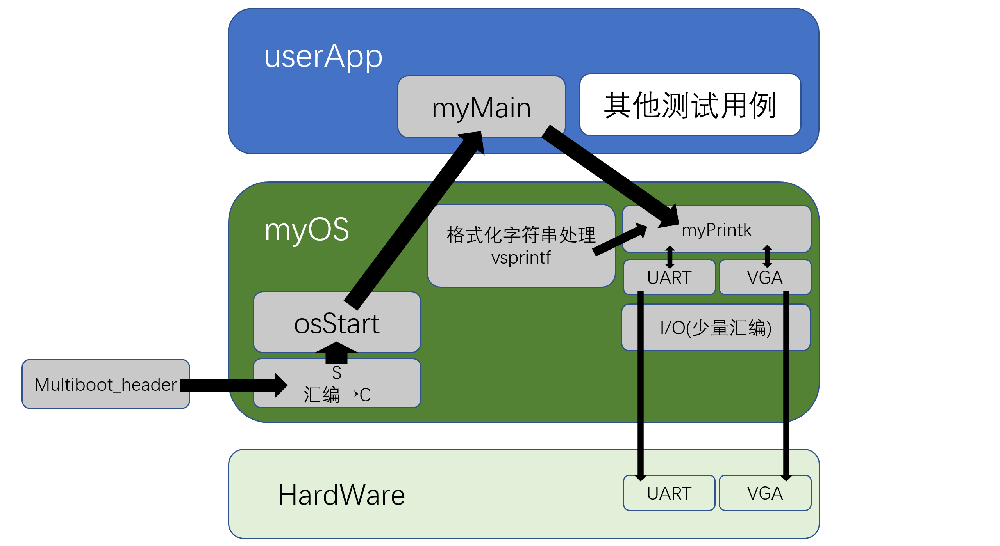
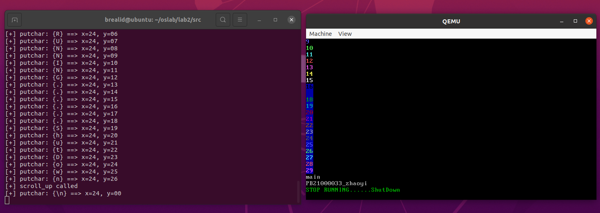

# Lab2 实验报告
PB21000033 赵奕

## 一、实验目标

- 从汇编语言到C语言的衔接

- 功能上，实现输出管理（清屏，滚屏等等）、格式化输入输出

- 设备包括VGA和串口

- 在软件层次和结构上，完成multiboot_header、myOS和userApp的划分，并分别实现，在文件目录组织和Makefile组织上体现

- 采用自定义测试用例和用户（助教）测试用例相结合的方式进行验收，并提供编译执行的脚本

## 二、实验内容

### 一、软件框图



软件层次分为 multiboot_header、myOS 和 userApp 三部分。

- multiboot_header 为系统启动部分，系统启动后进入
myOS
- myOS部分，首先执行osStart调用myMain进入userApp部分。在该部分中，myMain调用myPrintk以实现字符串输出的程序，而myPrintk程序实现依赖vsprintf的格式化字符串处理
- 硬件部分：UART与VGA输出。

### 二、主流程

multiboot_header.S $\to$ start32.S $\to$ osStart.c $\to$ myMain.c

1. 运行multibootHeader.S，启动操作系统
2. 在start32.S中调⽤osStart.c，转入执行osStart.c文件
3. 在osStart.c中完成操作系统初始化，进⼊userApp
4. 执行用户程序userApp - myMain.c

### 三、主要功能模块及其实现

#### I/O

该模块为端口输出以及光标控制，采用嵌入式汇编，将inb、outb两条汇编指令写成C语言的函数，在后续输出中调用。 inb函数读取并返回指定端口的值，outb函数将指定值输出到指定端口。

```cpp
typedef unsigned char uint8;
typedef unsigned short uint16;

uint8 inb(uint16 port_from) {
    uint8 _value;
    __asm__ __volatile__("inb %w1,%0":"=a"(_value):"Nd"(port_from));
    return _value;
}

void outb(uint16 port_to, uint8 value) {
    __asm__ __volatile__("outb %b0,%w1"::"a"(value),"Nd"(port_to));
}
```

#### 串口uart输出

通过串口输出/获取单个字符，输出一个字符串。

```cpp
typedef unsigned char uint8;
typedef unsigned short uint16;

extern void outb(uint16 port_to, uint8 value);
extern uint8 inb(uint16 port_from);

#define uart_base 0x3F8

void uart_put_char(unsigned char c) {
	outb(uart_base, c);      
}

unsigned char uart_get_char(void) {
	return inb(uart_base);       
}

void uart_put_chars(char *str) { 
	while (*str) outb(uart_base, *str++);  
}
```

#### VGA输出

该模块用于在QEMU窗口中实现清屏、屏幕输出功能，包括光标显示、光标控制、屏幕滚动等。

```cpp
#define VGA_BASE (char *)0xB8000	// VGA初始地址
#define VGA_WIDTH 80				// VGA屏幕每行的宽度
#define VGA_HEIGHT 25				// VGA屏幕每列的高度
#define CURSOR_PORT_INDEX 0x3D4		// 光标-索引串口
#define CURSOR_PORT_DATA 0x3D5		// 光标-数据串口

typedef unsigned char uint8;
typedef unsigned short uint16;

extern void outb(uint16 port_to, uint8 value);
extern uint8 inb(uint16 port_from);

// 调试用
extern void uart_put_char(uint8 c);
extern void uart_put_chars(char *str);

//VGA字符界面规格：25行80列
//VGA显存初始地址为0xB8000

short cur_line = 0, cur_column = 0;		//当前光标位置
char *vga_screen = VGA_BASE;

// 通过当前行值 cur_line 与列值 cur_column 回写光标
void update_cursor(void){
	uint16 pos = cur_line * VGA_WIDTH + cur_column;
  	outb(CURSOR_PORT_INDEX, 0x0E);
	outb(CURSOR_PORT_DATA, pos >> 8);	// 写高 8bit
	outb(CURSOR_PORT_INDEX, 0x0F);
	outb(CURSOR_PORT_DATA, pos & 0xff);	// 写低 8bit
}

// 获得当前光标，计算出 cur_line 和 cur_column 的值
void get_cursor_position(void){
	uint16 pos = 0;
  	outb(CURSOR_PORT_INDEX, 0x0E);
	pos |= inb(CURSOR_PORT_DATA) << 8;	// 读高 8bit
	outb(CURSOR_PORT_INDEX, 0x0F);
	pos |= inb(CURSOR_PORT_DATA);		// 读低 8bit
	cur_line = pos / 80;
	cur_column = pos % 80;
}

// 清屏
void clear_screen(void) {
	for (int i = 0; i < VGA_HEIGHT; ++i)
		for (int j = 0; j < VGA_WIDTH * 2; j += 2) {
			vga_screen[i * VGA_WIDTH * 2 + j] = 0x00;
			vga_screen[i * VGA_WIDTH * 2 + j + 1] = 0x07;
		}
	cur_column = cur_line = 0;
	update_cursor();
}

// 向上滚屏一行
void scroll_up() {
	uart_put_chars("[+] scroll_up called\n");
	for (int i = 1; i < VGA_HEIGHT; ++i)
		for (int j = 0; j < VGA_WIDTH * 2; ++j)
			vga_screen[(i - 1) * VGA_WIDTH * 2 + j] = vga_screen[i * VGA_WIDTH * 2 + j];
	for (int i = 0; i < VGA_WIDTH * 2; i += 2) {
		vga_screen[(VGA_HEIGHT - 1) * VGA_WIDTH * 2 + i] = 0x00;
		vga_screen[(VGA_HEIGHT - 1) * VGA_WIDTH * 2 + i + 1] = 0x07;
	}
    cur_line = 24;
}

// 输出字符及其颜色
void color_putchar(uint8 ch, uint8 color) {
	get_cursor_position();
    switch (ch) {
        case '\r':
        case '\n':
			cur_column = 80;
			break;
        case '\t':
			cur_column = ((cur_column >> 2) + 1) << 2;
			break;
		default:
			vga_screen[(cur_line * VGA_WIDTH + cur_column) * 2] = ch;
			vga_screen[(cur_line * VGA_WIDTH + cur_column) * 2 + 1] = color;
			++cur_column;
            break;
    }
	if (cur_column == VGA_WIDTH) {
		cur_column = 0;
		++cur_line;
	}
	if (cur_line == VGA_HEIGHT) scroll_up();
    update_cursor();
	// 以下：串口输出调试信息
	uart_put_chars("[+] putchar: {");
	switch (ch) {
		case '\r': uart_put_char('\\'); uart_put_char('r'); break;
		case '\n': uart_put_char('\\'); uart_put_char('n'); break;
		case '\t': uart_put_char('\\'); uart_put_char('t'); break;
		default: uart_put_char(ch); break;
	}
	uart_put_chars("} ==> x=");
	uart_put_char('0' | (cur_line / 10));
	uart_put_char('0' | (cur_line % 10));
	uart_put_chars(", y=");
	uart_put_char('0' | (cur_column / 10));
	uart_put_char('0' | (cur_column % 10));
	uart_put_chars("\n");
}

void append2screen(const char *str, int color) { 
	while (*str) color_putchar(*str++, color);
}
```

#### myPrint[kf]

该模块将字符串格式化输出（uart和vga输出）。

```cpp
char kBuf[400];
int myPrintk(int color,const char *format, ...){
    va_list argptr;

    va_start(argptr,format);//初始化argptr
    int count=vsprintf(kBuf,format,argptr);
    va_end(argptr);

    uart_put_chars(kBuf);//uart输出
    append2screen(kBuf,color);//VGA输出
	
    return count;
}

char uBuf[400];
int myPrintf(int color,const char *format, ...){
    va_list argptr;

    va_start(argptr,format);//初始化argptr
    int count=vsprintf(uBuf,format,argptr);
    va_end(argptr);

    uart_put_chars(uBuf);//uart输出
    append2screen(uBuf,color);//VGA输出
    
    return count;
}
```

并且独立编写了用于输出格式化的 `vsprintf` 函数（在该实验的特殊要求下只处进行了 `%d` 的格式化处理）。

```cpp
/*
 * 识别格式化字符串的核心代码写在本文件中
 * 可以从网上移植代码
 */ 
 
#include <stdarg.h>  

int vsprintf(char *buf, const char *fmt, va_list argptr) {
	static char buffer[32];
	int buf_top = 0;
	char *original_buf = buf;
	while (*fmt) {
		if (*fmt == '%') {
			if (*(fmt + 1) == '%') {
				*buf++ = '%';
				fmt += 2;
				continue;
			}
			if (*(fmt + 1) == 'd') {
				int value = va_arg(argptr, int);
				if (value < 0) {
					*buf++ = '-';
					value = -value;
				}
				while (value) {
					buffer[buf_top++] = '0' | (value % 10);
					value /= 10;
				}
				while (buf_top) *buf++ = buffer[--buf_top];
				fmt += 2;
				continue;
			}
		}
		*buf++ = *fmt++;
	}
	*buf = '\0';
	return buf - original_buf;
}
```

### 四、源代码组织说明

#### 目录组织

```sh
brealid@ubuntu:~/oslab/lab2/src$ tree --charset ASCII
.
|-- Makefile
|-- multibootheader
|   `-- multibootHeader.S
|-- myOS
|   |-- dev
|   |   |-- Makefile
|   |   |-- uart.c
|   |   `-- vga.c
|   |-- i386
|   |   |-- io.c
|   |   |-- io.h
|   |   `-- Makefile
|   |-- Makefile
|   |-- myOS.ld
|   |-- osStart.c
|   |-- printk
|   |   |-- Makefile
|   |   |-- myPrintk.c
|   |   `-- vsprintf.c
|   `-- start32.S
|-- output
|   |-- multibootheader
|   |   `-- multibootHeader.o
|   |-- myOS
|   |   |-- dev
|   |   |   |-- uart.o
|   |   |   `-- vga.o
|   |   |-- i386
|   |   |   `-- io.o
|   |   |-- osStart.o
|   |   |-- printk
|   |   |   |-- myPrintk.o
|   |   |   `-- vsprintf.o
|   |   `-- start32.o
|   |-- myOS.elf
|   `-- userApp
|       `-- main.o
|-- source2run.sh
`-- userApp
    |-- main.c
    `-- Makefile

13 directories, 28 files
```

#### Makefile组织

```
Makefile(src)
    -multibootHeader.o
    -Makefile(myOS)
        -Makefile(dev)
            -uart.o
            -vga.o
        -Makefile(i386)
            -io.o
        -osStart.o
        -Makefile(printk)
            -myPrintk.o
            -vsprintf.o
    -Makefile(userApp)
        -main.o
```

### 五、代码布局说明

代码和数据的起始内存为物理内存1M的位置。

- multiboot_header为前12个字节，向后对齐8字节，存放代码。
- 其后对齐16字节，用于存放数据段。
- 数据段之后，向后对齐16字节，存放BSS段。
- 最后向后对齐16字节，存放堆栈段。

### 六、编译过程说明

#### 编译所用指令：

```
make
qemu-system-i386 -kernel output/myOS.elf -serial stdio
```
或者直接
```
./source2run.sh
```

#### 编译过程

生成multibootHeader.o、uart.o、vga.o、io.o、vsprintf.o、myPrintk.o、main.o，链接生成myOS.elf文件

### 七、运行过程和运行结果说明

输入运行指令 `./source2run.sh` 后的结果如图：

