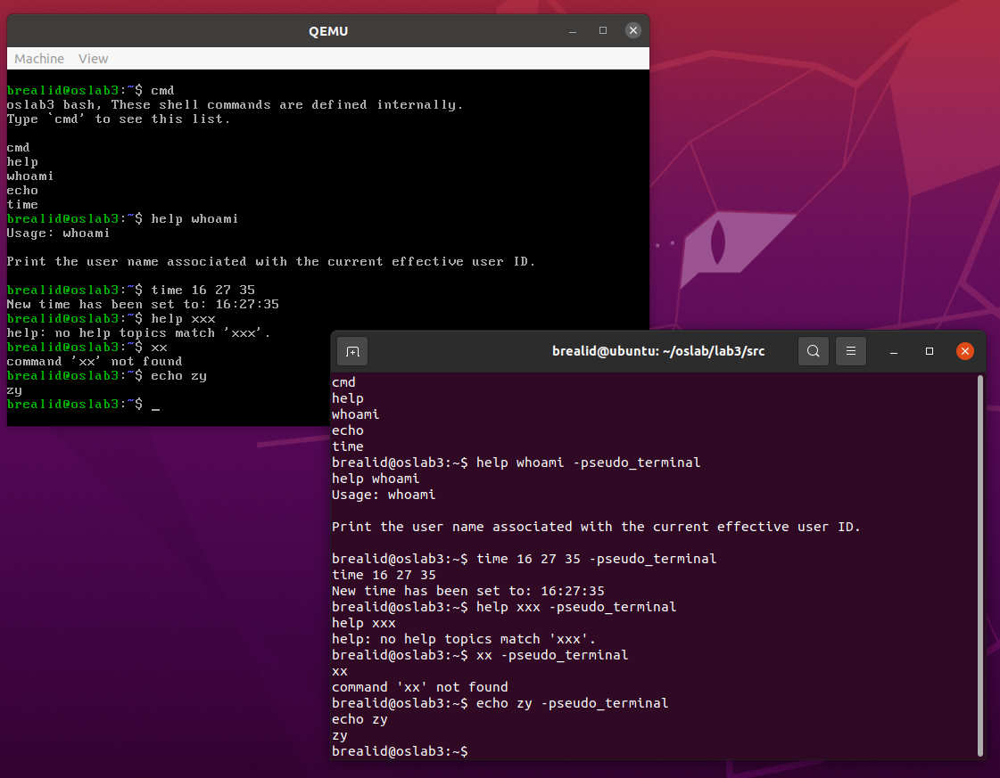

# Lab3 实验报告
PB21000033 赵奕

## 1 软件框图


- multiboot_header，来源 lab1
- start32.S 和 osStart.c 启动操作系统
- main.c 和 startShell.c 开启终端模拟   
- myPrintk 的编写，调用格式化字符串处理 vsprintf (代码来源网上)
- VGA 输出，代码来源 lab2
- 串口输入输出
- 中断处理与时钟，时钟的更新会调用函数进行屏幕上时间的更新

## 2 主流程及其实现
$multiboot\_header \rightarrow start32.S \rightarrow osStart.c \rightarrow main.c \rightarrow startShell.c$

- 从 multiboot_header 启动 OS
- 调用 start32.S -> osStart.c 进入操作系统
- 调用 userApp/main.c 进入 userApp/startShell.c 开启终端模拟

## 3 主要功能模块及其实现
### 3.1 中断机制及其初始化
1. 中断描述符表IDT及其初始化
2. 寄存器IDTR的初始化
3. 可编程中断控制器PIC i8259
4. 开关中断

start32.S [片段] 中断描述
```S
time_interrupt:
	cld
	pushf
  	pusha
	call tick
	popa
	popf
	iret
	
	.p2align 4
ignore_int1:
	cld
	pusha
	call ignoreIntBody
	popa
	iret
```

i8259A.c 中断控制器
```c
#include "io.h"

void init8259A(void){
	// 屏蔽所有中断源
    outb(0x21, 0xFF);
    outb(0xA1, 0xFF);

	// 主片初始化
    outb(0x20, 0x11); // ICW1
    outb(0x21, 0x20); // ICW2：起始向量号
    outb(0x21, 0x04); // ICW3：从片接入引脚位
    outb(0x21, 0x03); // ICW4：中断结束方式 AutoEOI

	// 从片初始化
    outb(0xA0, 0x11); // ICW1
    outb(0xA1, 0x28); // ICW2：起始向量号
    outb(0xA1, 0x02); // ICW3：接入主片的编号
    outb(0xA1, 0x01); // ICW4：中断结束方式
}
```
irq.S 开关中断
```S
.text
.code32
_start:

	.globl enable_interrupt
enable_interrupt:
	sti
	ret

	.globl disable_interrupt
disable_interrupt:
	cli
	ret
```
### 3.2 tick 维护
流程图：$tick.c\rightarrow wallClock.c$

i8253.c 时钟中断初始化
```c
#include "io.h"

void init8253(void) {
    outb(0x43, 0x34);
    // i8253 的时钟频率为 1.193182MHz
	// 分频参数可以通过以下公式计算：分频参数 = (时钟频率/中断频率)-1
	// 将100HZ代入公式，得到：分频参数 = 11931
    outb(0x40, 11931 & 0xff);
    outb(0x40, 11931 >> 8);
    outb(0x21, inb(0x21) & 0xFE);
}
```
tick.c 使用全局变量记录已经经过的 tick 并调用 tickUpdateClock 更新墙钟
```c
#include "wallClock.h"
int system_ticks = 0;

void tick(void) {
	++system_ticks;
	tickUpdateClock();
	return;
}
```

### 3.3 维护墙钟

- setWallClock 设置墙钟的开始时间
- getWallClock 获取墙钟当前时间

wallClock.c 接收 tick 更新信息，调用 hook 更新墙钟
```c
int hh, mm, ss, ms;

typedef void HookUpdateFunction(void);
HookUpdateFunction *updateClock_hook = 0;

void tickUpdateClock() {
	// 100HZ -> 10ms/tick
	ms += 10;
	if (ms >= 1000) {
		ms -= 1000;
		++ss;
	}
	if (ss >= 60) {
		ss -= 60;
		++mm;
	}
	if (mm >= 60) {
		mm -= 60;
		++hh;
	}
	if (hh >= 24) {
		hh -= 24;
	}
	if (updateClock_hook) updateClock_hook();
}

void setWallClock(int HH, int MM, int SS){
	if (HH < 0 || HH > 24) hh = 0;
	else hh = HH;
	if (MM < 0 || MM > 60) mm = 0;
	else mm = MM;
	if (SS < 0 || SS > 60) ss = 0;
	else ss = SS;
	if (updateClock_hook) updateClock_hook();
}

void getWallClock(int *HH, int *MM, int *SS){
	*HH = hh;
	*MM = mm;
	*SS = ss;
}

void setClockHook(HookUpdateFunction *newhook){
	updateClock_hook = newhook;
}
```

### 3.4 shell 的实现
用结构体存储所有注册了的命令
```c
typedef struct myCommand {
    char name[PART_LENGTH];
    char help_content[200];
    commandFunction *func;
} myCommand;

myCommand cmdList[200];
int cmdPtr = 0;
```
用 registerCommand 来注册命令
```c
void registerCommand(const char *name, const char *help_content, commandFunction *func) {
    strncpy(name, cmdList[cmdPtr].name, PART_LENGTH);
    strncpy(help_content, cmdList[cmdPtr].help_content, 200);
    cmdList[cmdPtr].func = func;
    ++cmdPtr;
}

registerCommand("cmd", "Usage: cmd\n\nList all command\n", func_cmd);
registerCommand("help", "Usage: help [command]\n\nDisplay info about [command]\n", func_help);
registerCommand("whoami", "Usage: whoami\n\nPrint the user name associated with the current effective user ID.\n", func_whoami);
registerCommand("div0", "Usage: div0\n\n(Test only) Throw a divide0 interrupt\n", func_div0);
registerCommand("echo", "Usage: echo [arg ...]\n\nWrite arguments to the standard output.\n", func_echo);
registerCommand("time", "Usage: time\n   or: time [h] [m] [s]\n\nQuery current time.\nOr change current time according to command arguments\n", func_time);
```
对输入进行分词，放入 argc, argv 中
```c
argc = 0;
int p = 0;
for (int i = 0; i < BUF_len; ++i)
    if (BUF[i] == ' ') {
        if (p) {
            argv[argc++][p] = '\0';
            p = 0;
        }
    } else {
        argv[argc][p++] = BUF[i];
    }
argv[argc][p] = '\0';
if (p) ++argc;
if (argc == 0) continue;
```
匹配命令并运行
```c
int success = 0;
for (int i = 0; i < cmdPtr; ++i)
    if (!strcmp(argv[0], cmdList[i].name)) {
        cmdList[i].func(argc, argv);
        success = 1;
    }
if (!success) myPrintk(0x07, "command '%s' not found\n", argv[0]);
```
各命令用函数实现
```c
int func_cmd(int argc, char (*argv)[PART_LENGTH]) {
    myPrintk(0x07, "oslab3 bash, These shell commands are defined internally.\nType `cmd' to see this list.\n\n");
    for (int i = 0; i < cmdPtr; ++i)
        myPrintk(0x07, "%s\n", cmdList[i].name);
    return 0;
}

int func_help(int argc, char (*argv)[PART_LENGTH]) {
    if (argc == 1) {
        myPrintk(0x07, "help: no argument.\n");
        return 1;
    }
    for (int i = 0; i < cmdPtr; ++i)
        if (!strcmp(argv[1], cmdList[i].name)) {
            myPrintk(0x07, "%s\n", cmdList[i].help_content);
            return 0;
        }
    myPrintk(0x07, "help: no help topics match '%s'.\n", argv[1]);
    return 1;
}

int func_whoami(int argc, char (*argv)[PART_LENGTH]) {
    myPrintk(0x07, "brealid\n");
    int a = 3/0;
    return 1;
}

int func_div0(int argc, char (*argv)[PART_LENGTH]) {
    myPrintk(0x07, "test: div0 interrupt\n");
    int a = 3 / 0;
    return 1;
}

int func_echo(int argc, char (*argv)[PART_LENGTH]) {
    for (int i = 1; i < argc; ++i)
        myPrintk(0x07, "%s%c", argv[i], " \n"[i == argc - 1]);
    return 1;
}

int func_time(int argc, char (*argv)[PART_LENGTH]) {
    if (argc == 1) {
        int h, m, s;
        getWallClock(&h, &m, &s);
        myPrintk(0x07, "Current time: %02d:%02d:%02d\n", h, m, s);
        return 0;
    } else if (argc == 4) {
        int h = atoi(argv[1]), m = atoi(argv[2]), s = atoi(argv[3]);
        setWallClock(h, m, s);
        getWallClock(&h, &m, &s);
        myPrintk(0x07, "New time has been set to: %02d:%02d:%02d\n", h, m, s);
        return 0;
    }
    myPrintk(0x07, "Usage: time\n   or: time [h] [m] [s]\n");
    return 1;
}
```
## 4 源代码说明
### 4.1 目录结构
```sh
brealid@ubuntu:~/oslab/lab3$ tree --charset ascii src
src
|-- compile_flags.txt
|-- Makefile
|-- multibootheader
|   `-- multibootHeader.S
|-- myOS
|   |-- dev
|   |   |-- i8253.c
|   |   |-- i8259A.c
|   |   |-- Makefile
|   |   |-- uart.c
|   |   `-- vga.c
|   |-- i386
|   |   |-- io.c
|   |   |-- irq.S
|   |   |-- irqs.c
|   |   `-- Makefile
|   |-- include
|   |   |-- i8253.h
|   |   |-- i8259A.h
|   |   |-- io.h
|   |   |-- irqs.h
|   |   |-- myPrintk.h
|   |   |-- tick.h
|   |   |-- uart.h
|   |   |-- vga.h
|   |   |-- vsprintf.h
|   |   `-- wallClock.h
|   |-- kernel
|   |   |-- Makefile
|   |   |-- tick.c
|   |   `-- wallClock.c
|   |-- Makefile
|   |-- myOS.ld
|   |-- osStart.c
|   |-- printk
|   |   |-- Makefile
|   |   |-- myPrintk.c
|   |   `-- vsprintf.c
|   `-- start32.S
|-- output
|   |-- multibootheader
|   |   `-- multibootHeader.o
|   |-- myOS
|   |   |-- dev
|   |   |   |-- i8253.o
|   |   |   |-- i8259A.o
|   |   |   |-- uart.o
|   |   |   `-- vga.o
|   |   |-- i386
|   |   |   |-- io.o
|   |   |   |-- irq.o
|   |   |   `-- irqs.o
|   |   |-- kernel
|   |   |   |-- tick.o
|   |   |   `-- wallClock.o
|   |   |-- osStart.o
|   |   |-- printk
|   |   |   |-- myPrintk.o
|   |   |   `-- vsprintf.o
|   |   `-- start32.o
|   |-- myOS.elf
|   `-- userApp
|       |-- main.o
|       `-- startShell.o
|-- source2run.sh
`-- userApp
    |-- main.c
    |-- Makefile
    `-- startShell.c

16 directories, 53 files
```
### 4.2 Makefile 结构
- Makefile(src)
    - multibootHeader.o
    - Makefile(myOS)
        - start32.o
        - osStart.o
        - Makefile(dev)
            - uart.o
            - vga.o
            - i8259A.o 
            - i8253.o
        - Makefile(i386)
            - io.o
            - irqs.o
            - irq.o
        - Makefile(printk)
            - myPrintk.o
            - vsprintf.o
        - Makefile(kernel)
            - tick.o
            - wallClock.o
    - Makefile(userApp)
        - main.o
        - startShell.o
## 5 代码布局说明
代码和数据的起始内存为物理内存1M的位置。

- multiboot_header为前12个字节，向后对齐8字节，存放代码。
- 其后对齐16字节，用于存放数据段。
- 数据段之后，向后对齐16字节，存放BSS段。
- 最后向后对齐16字节，存放堆栈段。
### 6 编译过程说明

```
make
qemu-system-i386 -kernel output/myOS.elf -serial pty &
```
或者直接
```
./source2run.sh
```
### 7 运行结果截图

