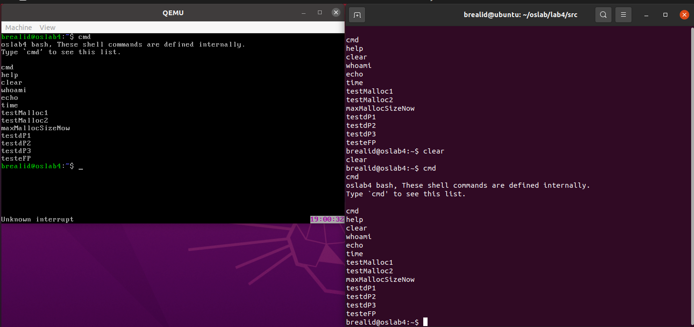
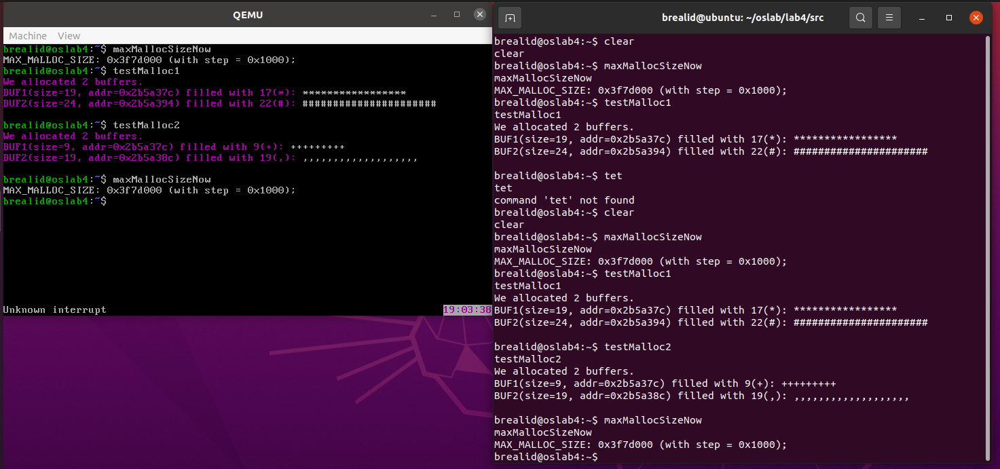
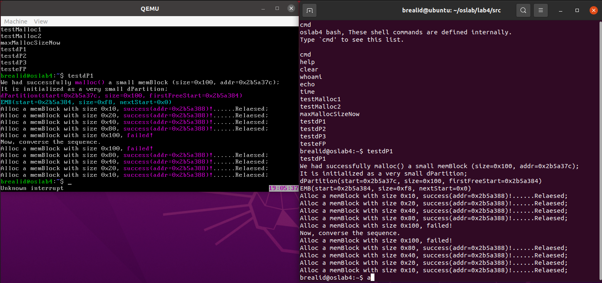
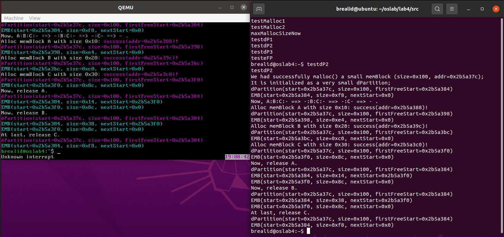
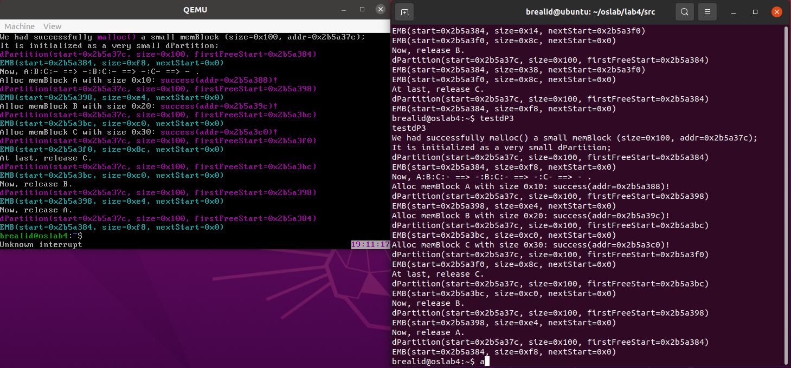
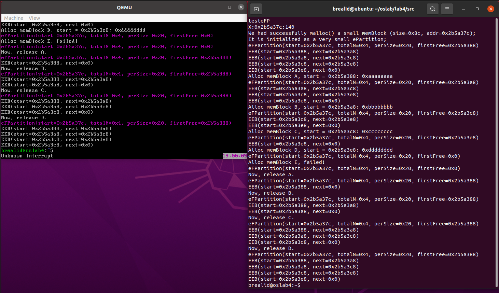

# Lab4 实验报告
PB21000033 赵奕

## 一、实验目标
这次实验要为我们的 OS 内核实现内存管理，为用户提供 malloc/free 接口，并用我们写的 shell 进行测试

附加实验（kmalloc, kfree）：也已实现。具体实现方式在**第三节**的问题 1 中有所展现

## 二、源代码说明
### 如何维护空闲链表
dPartition：空闲块的块首用一个结构体来描述这个空闲块
```cpp
typedef struct EMB {
	unsigned long size;
	union {
		unsigned long nextStart;    // if free: pointer to next block
        unsigned long userData;		// if allocated, belongs to user
	};	                           
} EMB; // 共占8个字节
```
需要注意，我的实现中 ``size`` 包括了 EMB 块自身。考虑到在内存分配过程中 size 变量不应该被覆盖，因此每一个 EMB 块对应的实际可用存储空间大小为 ``size - 4``

eFPartition：这种方式一个很大的区别是，每个块的 size 固定，故空闲块首的结构体只需要保存 next_start 即可。需要注意：虽然这里没有写 union 体，但是本质上和 EMB 是一样的（如果这个块被使用了，那么 next_start 会被 user_data 覆盖）
```cpp
typedef struct EEB {
	unsigned long next_start;
} EEB;	// 共占4个字节
```
其他链表实现细节类似，不过在处理上会简便很多。另外，eFP 的方式每个结构体所管辖的范围是一定的，因此在初始时整条链表就已经全部建立，后续分配空间的过程是从链表中删除节点的过程。

### 释放后合并空间
dPartition：这次实现的链表是单向链表，因此处理释放空间没有那么简单，因为我们需要先找到 blockPre 和 blockNxt 即待释放空间前后的 EMB 块   
找到后，我们选择先测试与后面的链接（即是否能与后方空闲 EMB 块合并）再测试与前面的链接（是否能与前方空闲 EMB 块合并）  
需要注意，如果 blockPre 不存在，可能需要修改相应 dpHandler 的相关属性 ``firstFreeStart``

eFPartition：同样需要找到前后的空闲 EEB 块。与 dPartition 简化之处在于，不需要考虑合并空闲块的操作，只需要简单插入节点到链表中就可以了。

## 三、问题回答 (思考题)
### 1. malloc 接口的具体实现
首先简述 malloc/free 和 kmalloc/kfree 如何相关隔离。

在 ``pMemInit.c`` 里面，获取了可用的内存大小之后，我先将所有空闲空间作为一个整体调用 ``dPartitionInit``，管理句柄保存在变量 ``pMemHandler`` 中。  
接下来，我从 ``pMemHandler`` 中申请了两块空间，大小分别为 $\frac{pMemSize}{3}$ 和 $\frac{pMemSize}{2}$，前者用作 kernel 内存分配，后者用作 user 内存分配。  
对这两块空间分别进行 ``dPartitionInit`` 并分别保存句柄于变量 ``kMemHandler, uMemHandler`` 中即可。  

然后描述 malloc/free 接口的调用过程

malloc:（kmalloc 同理，除了第一步中改用 kMemHandler 句柄）  
1. ``malloc``: 调用 ``dPartitionAlloc(uMemHandler, size)``（使用 dPartition 管理空间，空间管理句柄为 uMemHandler）  
2. ``dPartitionAlloc``: 调用 ``dPartitionAllocFirstFit(dp, size)``（使用 first fit 分配算法申请空间）  


free:（kfree 同理，除了第一步中改用 kMemHandler 句柄）  
1. ``free``: 调用 ``dPartitionFree(uMemHandler, start)``（使用 dPartition 管理空间，空间管理句柄为 uMemHandler）  
2. ``dPartitionFree``: 调用 ``dPartitionFreeFirstFit(dp, start)``（first fit 分配算法对应的回收空间函数）  

### 2. 运行结果
基础指令 cmd 列出所有可执行命令，clear 命令清屏  


---

先后运行：maxMallocSizeNow，testMalloc1，testMalloc2，maxMallocSizeNow  
可以发现空间正常申请释放赋值。  
且可以由 testMalloc2 的运行结果（申请的地址）发现 testMalloc1 申请的空间有被正常释放。这一点也可以从两次 maxMallocSizeNow 中看出   


---

运行 testdP1，运行结果符合预期  
注意到，虽然申请了 0x100 大小的空间，但是由于 dPartition 占据了一定的空间，因此仅有 0xf8 大小的空间可用，故 malloc(0x100) 失败，这是符合预期的  


---

testdP2 的输出长度比较长，查看不到的部分选择在串口中查看     
testdP2 的过程正如输出所描绘，以这样的形式展现：   
``-`` $\rightarrow$ ``A:-`` $\rightarrow$ ``A:B:-`` $\rightarrow$ ``A:B:C:-`` $\rightarrow$ ``-:B:C:-`` $\rightarrow$ ``-:C:-`` $\rightarrow$ ``-``  
输出符合这一情况  


---

testdP3 将释放的过程反了过来，因此我们看不到多个 EMB 共存的情况，输出同样符合预期     
testdP3 的过程：  
``-`` $\rightarrow$ ``A:-`` $\rightarrow$ ``A:B:-`` $\rightarrow$ ``A:B:C:-`` $\rightarrow$ ``A:B:-`` $\rightarrow$ ``A:-`` $\rightarrow$ ``-``  


---

testeFP 测试了 eFP 的接口。首先有申请的大小 140 = 32 * 4 + 12，其中 12 是 struct eFPartition 句柄的大小，32 是对齐后的块大小   
可以看到申请空间就是删除链表的过程，释放空间就是插入链表的过程  
考虑到我们的 n=4 故最终仅有 A,B,C,D 空间申请成功，E 申请失败  
可以看到对空间的赋值操作等也都是成功的  


## 四、遇到的问题和解决方法
string.h 编译 warning: 将 src 的数据类型改成 const unsigned char * 即可（否则会产生 const 修饰符丢失的错误）  

初始 init 的一些信息无法显示: 注释 main.c 中的 clear_screen(); 即可看到信息显示  

