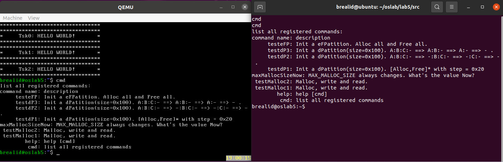

# Lab5 实验报告

本次报告省略了大部分说明，仅保留文档要求的思考题与运行结果

## 思考题

1. 在上下文切换的现场维护中，pushf和popf对应，pusha和popa对应，call和ret对应，但是为什么 CTS SW 函数
中只有ret而没有call呢？  
   > 这段代码本身是作为实现上下文切换的代码片段嵌入的，所以不需要使用call指令调用
2. 谈一谈你对stack init函数的理解。  
   > stack_init()函数用于初始化栈空间。  
   > ``unsigned long **stk``: stk为一个二级指针，通过stk可以修改指向栈顶的指针的值。  
   > ``void (*task)(void)``: task为一个指向函数的指针，此处指向进程的任务函数。  
   > 这段代码向下移动堆栈指针，在每个遍历的位置上设置不同的值来初始化堆栈，而这些值对应寄存器的初始值。
3. myTCB结构体定义中的``stack[STACK SIZE]``的作用是什么？``BspContextBase[STACK SIZE]``的作用又是什么？  
   > 在myTCB结构体的定义中，stack[STACK_SIZE]数组用于为每个任务分配栈空间。每个任务都需要一个栈来存储其执行上下文，包括寄存器的值、局部变量和函数调用信息。stack数组用于保留这个空间。  
   > BspContextBase[STACK_SIZE]数组的作用是为启动多任务调度模式准备一个基本的上下文。在任务切换时，需要保存当前任务的执行上下文，并加载下一个任务的执行上下文。BspContextBase数组用于保存 BSP的上下文信息，包括寄存器的值、堆栈指针等。由于BSP的上下文信息在任务切换时不会改变，所以只需要保存一次即可，而每个任务的上下文信息在任务切换时会改变，所以需要为每个任务分配一个栈空间。
4. prevTSK StackPtr是一级指针还是二级指针？为什么？  
   > prevTSK StackPtr是一个二级指针，它指向保存前一个任务的栈指针的地址。  
   > 使用这个二级指针，我们可以修改指针所指向的地址，以便在任务切换时将下一个任务的栈指针地址赋予它，从而可以在切换回该任务时正确恢复栈的状态。
   > 如果使用一级指针，那么我们只能修改指针所指向的值，而不能修改指针本身的值，这样就无法在任务切换时正确恢复栈的状态。

## 运行结果
