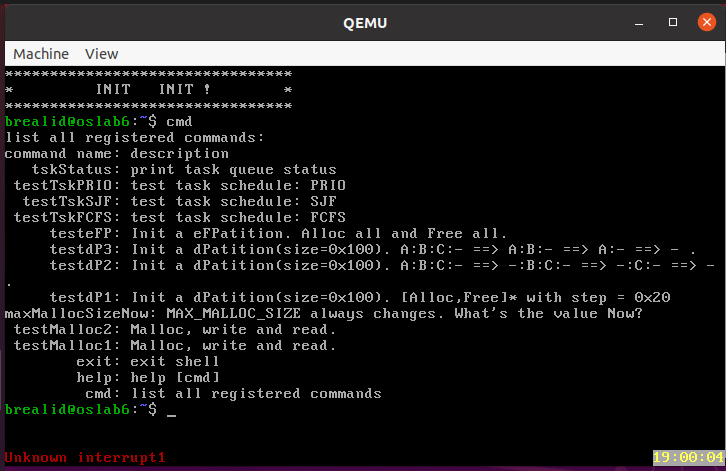
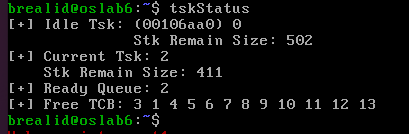
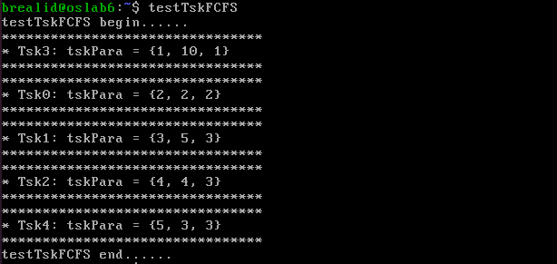
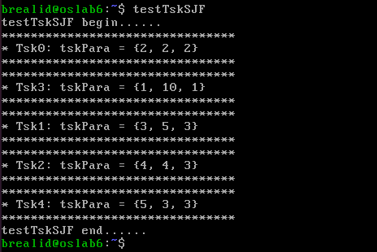
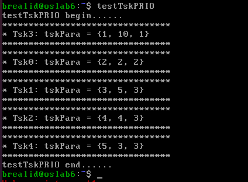

# Lab6 实验报告
PB21000033 赵奕

## 进程管理部分架构

```
.
|-- task.c
|-- task_FCFS.c
|-- task_SJF.c
|-- task_PRIO.c
`-- task_interface.c
```

说明：task.c 为进程管理的主要文件，根本逻辑是通过每个 myTCB 的 priority 参数来控制进程的优先级，并每次在 createTsk 的时候根据优先级插入到队列中合适的位置

task_FCFS.c、task_SJF.c、task_PRIO.c 为三种调度算法的实现，本质上分别将 arrTime, exeTime, priority 作为 myTCB 的 priority 参数，然后调用 task.c 中的函数

task_interface.c 为进程管理的接口文件，主要是对 task.c 中的函数进行了封装，使得调用更加方便，并提供了 switchScheduler 函数作为切换调度算法的接口

## 重点函数解释

### tskEnqueue

tskEnqueue 函数的作用是将一个任务插入到就绪队列中。

具体来说，

+ 如果队列为空，那么直接将任务插入到队列中
+ 如果优先级比当前正在执行的任务高，那么将任务插入到队列的最前面，并做上下文切换
+ 否则遍历队列，找到第一个优先级比自己低的任务，然后将自己插入到该任务之前


### createTsk

createTsk 函数的大致流程如下：

+ 首先，函数会为任务分配一个 myTCB 结构体，并初始化其中的各个参数，包括任务状态、优先级、堆栈指针等等。
+ 然后，函数会将任务插入到就绪队列中，这里的插入是按照任务的优先级进行排序的，优先级越高的任务越靠前。
+ 最后，函数会返回一个指向 myTCB 结构体的指针，供其他函数使用。

### switchScheduler

switchScheduler 函数是用来切换调度算法的接口，它的作用是根据传入的参数选择不同的调度算法，并将其设置为当前正在使用的调度算法。

本质上将一个变量 nowScheduler 设置为对应调度算法的值，然后在调用 createTsk 函数的时候，会根据 nowScheduler 的值来选择正确的优先级参数。

## 自编测试用例

| Tsk | arrTime | exeTime | priority | note |
|:-:|:-:|:-:|:-:|:-:|
| Tsk0 | 2 | 2 | 2 | 调用了 Tsk3 |
| Tsk1 | 3 | 5 | 3 | |
| Tsk2 | 4 | 4 | 3 | |
| Tsk3 | 1 | 10 | 1 | |
| Tsk4 | 5 | 3 | 3 | |

每个子 tsk 的输出中也包括自己的 arrTime, exeTime, priority

## 运行结果

### 命令列表: cmd

展示了所有的命令



### 进程状态: tskStatus

这是我们自编的用于显示进程状态的命令，包括 idleTsk 和当前正在运行的进程的状态，以及就绪队列中的进程编号，和空进程队列编号



### 进程调度: FCFS



因为我们设置了 tsk3 的 arrTime 早于 tsk0，所以 tsk3 会先执行，然后 tsk0 执行。

tsk1, tsk2, tsk4 紧随其后执行

### 进程调度: SJF



因为我们设置了 tsk3 的 exeTime 长于 tsk0，所以这次 tsk0 会先执行，然后 tsk3 执行。

需要注意，虽然我们设置 tsk1, tsk2, tsk4 的 exeTime 依次递增，但是由于我们设置 shell 的优先级在所有时刻都是最低的。  
因此在 shell 调用 createTsk 的时候，tsk1, tsk2, tsk4 一旦被 create 就会被立即切换，导致 tsk1 在 tsk2, tsk4 create 之前就执行完了。  
这也导致了运行结果看起来的不合理，但是这是符合预期的

### 进程调度: PRIO



因为我们设置了 tsk3 的 priority 高于 tsk0，所以 tsk3 会先执行，然后 tsk0 执行。

tsk1, tsk2, tsk4 的 priority 一致，因此会按照 FCFS 的顺序执行
